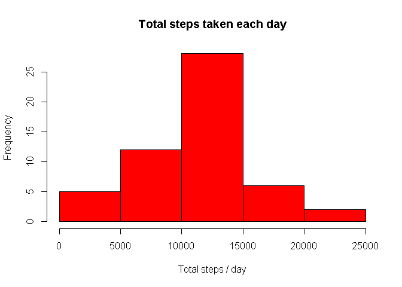
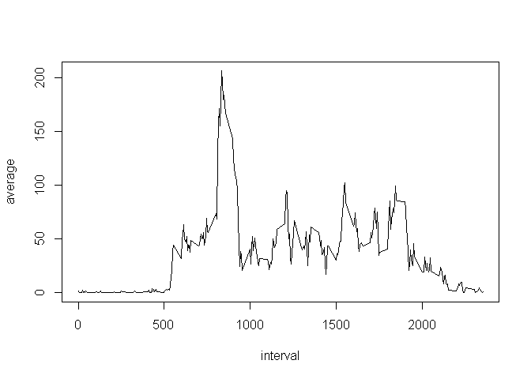
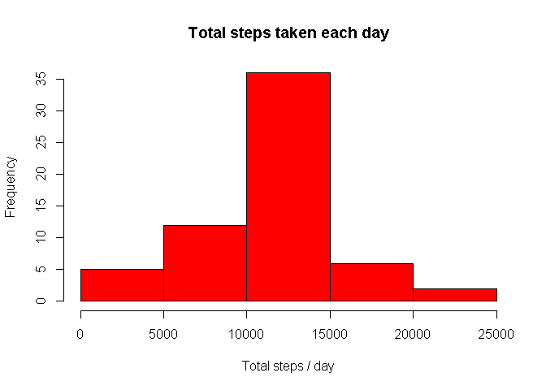
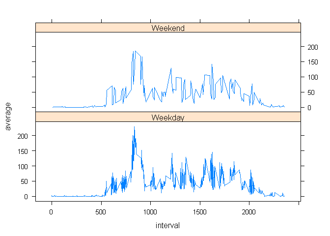

# Reproducible Research: Peer Assessment 1


## Loading and preprocessing the data


```r
require(dplyr,warn.conflicts=FALSE,quietly=TRUE)
activity <- read.csv(unzip("activity.zip", "activity.csv"),stringsAsFactors=FALSE)
```

## What is mean total number of steps taken per day?


```r
activity_q1 <- select(activity,-interval)
activity_q1 <- group_by(activity_q1,date)
activity_q1 <- summarize(activity_q1,steps=sum(steps))

with(activity_q1, hist(steps,main = "Total steps taken each day",col="Red",
                    xlab= "Total steps / day"))
```

 

### Mean and Median total number of steps taken per day


```r
activity_q11 <- group_by(activity_q1)
activity_q11 <- summarize(activity_q11,mean=round(mean(steps,na.rm=TRUE)),median=median(steps,na.rm=TRUE))
print.table(activity_q11)
```

```
##   mean median 
##  10766  10765
```


## What is the average daily activity pattern?


```r
activity_q2 <- group_by(activity,interval)
activity_q2 <- summarize(activity_q2,average=mean(steps,na.rm=TRUE))
plot(average ~ interval, type = "l", data = activity_q2)
```

 

### Max average steps interval


```r
mavg <- max(activity_q2$average)
activity_q2[activity_q2$average==mavg,"interval"]
```

```
## Source: local data frame [1 x 1]
## 
##   interval
## 1      835
```


## Imputing missing values

### For five minute intervals; Mean rounded to nearest number


```r
library(data.table,warn.conflicts=FALSE,quietly=TRUE)

DT1 <- data.table(activity)
DT2 <- data.table(activity_q2)
setkey(DT1,interval); setkey(DT2,interval)
DT3 <- merge(DT1,DT2)
DT3 <- mutate(DT3,steps = ifelse(is.na(steps),round(average),steps))
activity_q3 <- select(DT3,-interval,-average)
activity_q3 <- group_by(activity_q3,date)
activity_q3 <- summarize(activity_q3,steps=sum(steps))

with(activity_q3, hist(steps,main = "Total steps taken each day",col="Red",
                    xlab= "Total steps / day"))
```

 

### Mean and Median total number of steps taken per day


```r
activity_q31 <- group_by(activity_q3)
activity_q31 <- summarize(activity_q31,mean=round(mean(steps)),median=median(steps))
print.table(activity_q31)
```

```
##   mean median 
##  10766  10762
```

## Are there differences in activity patterns between weekdays and weekends?


```r
DT4 <- mutate(DT3,wd = as.factor(ifelse(weekdays(as.Date(date)) %in% c("Saturday","Sunday"),"Y","N")))
require(lattice,warn.conflicts=FALSE,quietly=TRUE)
DT4 <- group_by(DT4,interval,wd)
DT5 <- summarize(DT4,average=mean(steps))
f <- factor(DT4$wd, labels = c("Weekday", "Weekend"))
xyplot(average ~ interval | f, data=DT5,type="l",layout = c(1, 2)) 
```

 
